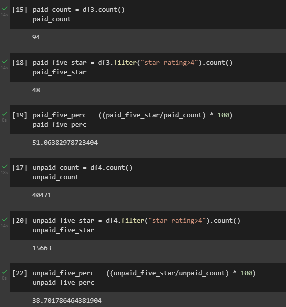

# Amazon Vine Analysis

## Overview

The purpose of this analysis is to determine whether or not the Amazon Vine Review program holds any bias towards paying members. 

Tools: Python, PostgreSQL, Spark, AWS
Dataset: S3 bucket: Amazon Reviews-Video Games

## Results

As shown in the following figure :
- There were 94 Vine (paid) reviews.
- There were 40,471 non-Vine (unpaid) reviews.
- There were 48 Vine 5-Star reviews
- There were 15,663 non-Vine reviews.

### 51% of paid user reviews were 5-Star.

### 38% of unpaid user reviews were 5-star.

In the example below, duplicates were dropped while creating a products dataFrame.

    #Create the products_table DataFrame and drop duplicates. 
    #products_df = df.select([""]).drop_duplicates()
    products_df = df.select(["product_id","product_title"]).drop_duplicates()
    products_df.show()

    #Create the review_id_table DataFrame. 
    #Convert the 'review_date' column to a date datatype with to_date("review_date", 'yyyy-MM-dd').alias("review_date")
    #review_id_df = df.select([, to_date("review_date", 'yyyy-MM-dd').alias("review_date")])
    review_id_df = df.select(["review_id", "customer_id", "product_id", "product_parent", to_date("review_date", 'yyyy-MM-dd').alias("review_date")])
    review_id_df.show()

## Summary

Based on this dataset of Amazon Vine video game reviews, there was a positivity bias for reviews in the Vine program. With paid reviews having a 51% five-star rate compared to unpaid having a 38% rate, there was a difference of 13%. It would be a prudent strategy to utilize statistics to determine what the probability is that the difference is due to random chance, or a limited dataset. 
